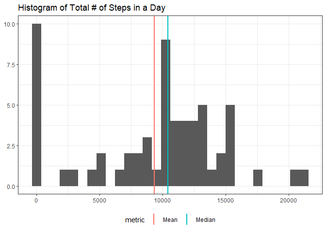
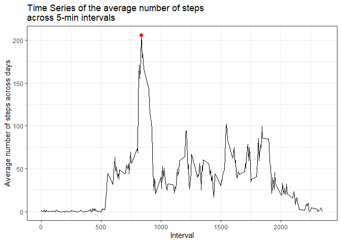
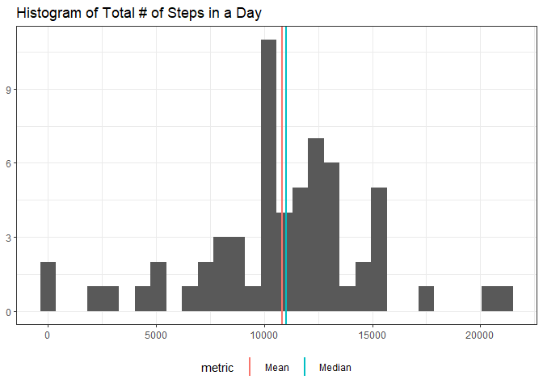
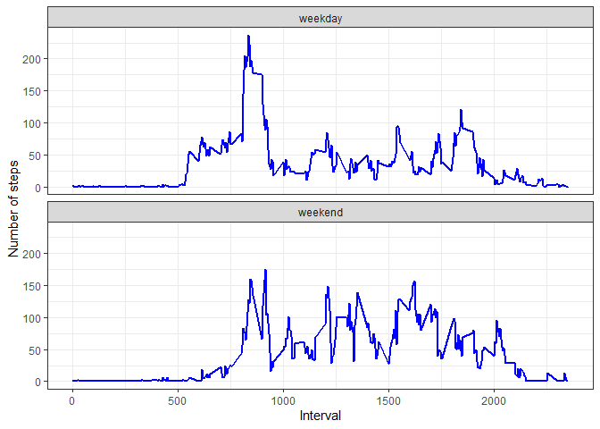

## Loading and preprocessing the data


```r
# Load the necessary libraries for analysis
library(dplyr)
library(ggplot2)
library(skimr)
library(tidyr)
```

We'll start by unzipping and loading the data. If the data is already unzipped it is just loaded.


```r
if (!file.exists("activity.csv")) {
  
  unzip("activity.zip")
  
}

df <- read.csv("activity.csv") %>%
  mutate(date = as.Date(date, "%Y-%m-%d"))
```


## What is mean total number of steps taken per day?

For this part, we are ignoring the missing values in the dataset. Below is a histogram of the total number of steps taken every day.


```r
steps <- df %>% 
  group_by(date) %>% 
  summarise(total_steps = sum(steps, na.rm = TRUE), .groups = "drop")

summary <- steps %>% 
  summarise(Mean = mean(total_steps), Median = median(total_steps)) %>% 
  pivot_longer(cols = everything(), names_to = "metric", values_to = "value")

hist <- ggplot(steps, aes(total_steps)) + 
  geom_histogram(bins = 30) + 
  geom_vline(data = summary, mapping = aes(xintercept = value, color = metric), size = 1, show.legend = TRUE) + 
  theme_bw() + 
  theme(legend.position = "bottom") + 
  xlab(NULL) + 
  ylab(NULL) + 
  ggtitle("Histogram of Total # of Steps in a Day")
  
hist
```

<!-- -->

The mean and median of the total number of steps in a day is shown in the table below:


```r
summary
```

```
## # A tibble: 2 x 2
##   metric  value
##   <chr>   <dbl>
## 1 Mean    9354.
## 2 Median 10395
```

## What is the average daily activity pattern?

We plot the average number of steps for each 5-minute interval across all days.


```r
interval_mean <- df %>% 
  group_by(interval) %>% 
  summarise(mean_steps = mean(steps, na.rm = TRUE), .groups = "drop")

max_interval_mean <- interval_mean %>% 
  filter(mean_steps == max(mean_steps)) %>% 
  separate(interval, sep = -2, into = c("hour", "minute"), remove = FALSE)

ts <- ggplot(interval_mean, aes(interval, mean_steps)) + 
  geom_line() + 
  geom_point(data = max_interval_mean, size = 2, colour = "red") + 
  theme_bw() + 
  xlab("Interval") + 
  ylab("Average number of steps across days") + 
  ggtitle("Time Series of the average number of steps \nacross 5-min intervals")

ts
```

<!-- -->

The maximum number of average steps across all days and intervals is 206.1698113, which happened at 8 hours and 35 minutes.

## Imputing missing values


```r
missing <- df %>% 
  count(missing = sum(is.na(steps))) %>% 
  mutate(percentage = missing / n)
```

There are a number of days/intervals where we have missing values for the numbers of steps. Specifically there are 2304 values, which correspond to 0.1311475 % of the dataset. Instead of ignoring the observations that have missing values, we can try to impute the missing step data using the mean number of steps for each 5-min interval and each day of the week. If we assume that the individual has a daily schedule they stick to, then it can be a reasonable approximation.


```r
wd_int_impute <- df %>% 
  mutate(wday = weekdays(date)) %>% 
  filter(!is.na(steps)) %>% 
  group_by(wday, interval) %>% 
  summarise(mean_imp_steps = mean(steps), .groups = "drop") 

# New data set with imputed information for missing steps

imp_df <- df %>%
  mutate(wday = weekdays(date)) %>%
  left_join(wd_int_impute, by = c("wday", "interval")) %>%
  mutate(steps = ifelse(is.na(steps), mean_imp_steps, steps))
```


```r
imp_steps <- imp_df %>% 
  group_by(date) %>% 
  summarise(total_steps = sum(steps, na.rm = TRUE), .groups = "drop")

imp_summary <- imp_steps %>% 
  summarise(Mean = mean(total_steps), Median = median(total_steps)) %>% 
  pivot_longer(cols = everything(), names_to = "metric", values_to = "value")

imp_hist <- ggplot(imp_steps, aes(total_steps)) + 
  geom_histogram() + 
  geom_vline(data = imp_summary, mapping = aes(xintercept = value, color = metric), size = 1, show.legend = TRUE) + 
  theme_bw() + 
  theme(legend.position = "bottom") + 
  xlab(NULL) + 
  ylab(NULL) + 
  ggtitle("Histogram of Total # of Steps in a Day")
  
imp_hist
```

```
## `stat_bin()` using `bins = 30`. Pick better value with `binwidth`.
```

<!-- -->

The mean and the median after imputing the missing values are: 


```r
imp_summary
```

```
## # A tibble: 2 x 2
##   metric  value
##   <chr>   <dbl>
## 1 Mean   10821.
## 2 Median 11015
```

Using the mean of the number of steps for each interval and day of the week leads to an increase of 15.6825326% to the mean and 5.964406% to the median.  

## Are there differences in activity patterns between weekdays and weekends?

We already added the days of the week to our dataset, let's classify each entry on whether it falls on a weekend or a weekday and see if there are any differences.


```r
wd <- imp_df %>% 
  mutate(wk = factor(ifelse(wday %in% c("Saturday", "Sunday"), "weekend", "weekday"))) %>% 
  group_by(wk, interval) %>% 
  summarise(mean_wk_steps = mean(steps), .groups = "drop")

wd_lineplot <- ggplot(wd, aes(interval, mean_wk_steps)) + 
  geom_line(size = 1, colour = "blue") + 
  facet_wrap(vars(wk), nrow = 2) + 
  labs(x = "Interval", y = "Number of steps") + 
  theme_bw()

wd_lineplot
```

<!-- -->

We can observe some differences in the pattern of movement between weekdays and weekends. First, movement seems to start earlier in the morning on weekdays, usually at the same time as well. Movement peaks on weekdays around 9 am and is slightly higher compared to the relative intervals on the weekend. Furthermore, movement reduces after 10 am and is lower on the weekdays compared to the the weekend. Generally on the weekend there is more movement on average throughout the day and more balanced throughout the period between 9am and 8pm, without excessive peaks like we see on weekdays early in the morning.  

