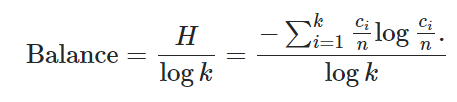

```{r setup, include=FALSE}
knitr::opts_chunk$set(
	echo = TRUE,
	message = FALSE,
	warning = FALSE
)
```

```{r libraries}

# General data wrangling
library(tidyverse)
library(skimr)

# Modeling packages
library(tidymodels)
library(discrim)

# Visualization
library(corrr)
library(plotly)

# Parallelization
library(doParallel)

# EDA
# library(DataExplorer)
# library(explore)


```

```{r data, warning=FALSE}

read_data <- function(url) {
  
  read_csv(url, 
           col_types = cols(
                            user_name = col_character(),
                            raw_timestamp_part_1 = col_character(),
                            raw_timestamp_part_2 = col_character(),
                            cvtd_timestamp = col_datetime("%d/%m/%Y %H:%M"),
                            new_window = col_character(),
                            num_window = col_double(),
                            roll_belt = col_double(),
                            pitch_belt = col_double(),
                            yaw_belt = col_double(),
                            total_accel_belt = col_double(),
                            kurtosis_roll_belt = col_character(),
                            kurtosis_picth_belt = col_character(),
                            kurtosis_yaw_belt = col_character(),
                            skewness_roll_belt = col_character(),
                            skewness_roll_belt.1 = col_character(),
                            skewness_yaw_belt = col_character(),
                            max_roll_belt = col_character(),
                            max_picth_belt = col_character(),
                            max_yaw_belt = col_character(),
                            min_roll_belt = col_character(),
                            min_pitch_belt = col_character(),
                            min_yaw_belt = col_character(),
                            amplitude_roll_belt = col_character(),
                            amplitude_pitch_belt = col_character(),
                            amplitude_yaw_belt = col_character(),
                            var_total_accel_belt = col_character(),
                            avg_roll_belt = col_character(),
                            stddev_roll_belt = col_character(),
                            var_roll_belt = col_character(),
                            avg_pitch_belt = col_character(),
                            stddev_pitch_belt = col_character(),
                            var_pitch_belt = col_character(),
                            avg_yaw_belt = col_character(),
                            stddev_yaw_belt = col_character(),
                            var_yaw_belt = col_character(),
                            gyros_belt_x = col_double(),
                            gyros_belt_y = col_double(),
                            gyros_belt_z = col_double(),
                            accel_belt_x = col_double(),
                            accel_belt_y = col_double(),
                            accel_belt_z = col_double(),
                            magnet_belt_x = col_double(),
                            magnet_belt_y = col_double(),
                            magnet_belt_z = col_double(),
                            roll_arm = col_double(),
                            pitch_arm = col_double(),
                            yaw_arm = col_double(),
                            total_accel_arm = col_double(),
                            var_accel_arm = col_character(),
                            avg_roll_arm = col_character(),
                            stddev_roll_arm = col_character(),
                            var_roll_arm = col_character(),
                            avg_pitch_arm = col_character(),
                            stddev_pitch_arm = col_character(),
                            var_pitch_arm = col_character(),
                            avg_yaw_arm = col_character(),
                            stddev_yaw_arm = col_character(),
                            var_yaw_arm = col_character(),
                            gyros_arm_x = col_double(),
                            gyros_arm_y = col_double(),
                            gyros_arm_z = col_double(),
                            accel_arm_x = col_double(),
                            accel_arm_y = col_double(),
                            accel_arm_z = col_double(),
                            magnet_arm_x = col_double(),
                            magnet_arm_y = col_double(),
                            magnet_arm_z = col_double(),
                            kurtosis_roll_arm = col_character(),
                            kurtosis_picth_arm = col_character(),
                            kurtosis_yaw_arm = col_character(),
                            skewness_roll_arm = col_character(),
                            skewness_pitch_arm = col_character(),
                            skewness_yaw_arm = col_character(),
                            max_roll_arm = col_character(),
                            max_picth_arm = col_character(),
                            max_yaw_arm = col_character(),
                            min_roll_arm = col_character(),
                            min_pitch_arm = col_character(),
                            min_yaw_arm = col_character(),
                            amplitude_roll_arm = col_character(),
                            amplitude_pitch_arm = col_character(),
                            amplitude_yaw_arm = col_character(),
                            roll_dumbbell = col_double(),
                            pitch_dumbbell = col_double(),
                            yaw_dumbbell = col_double(),
                            kurtosis_roll_dumbbell = col_character(),
                            kurtosis_picth_dumbbell = col_character(),
                            kurtosis_yaw_dumbbell = col_character(),
                            skewness_roll_dumbbell = col_character(),
                            skewness_pitch_dumbbell = col_character(),
                            skewness_yaw_dumbbell = col_character(),
                            max_roll_dumbbell = col_character(),
                            max_picth_dumbbell = col_character(),
                            max_yaw_dumbbell = col_character(),
                            min_roll_dumbbell = col_character(),
                            min_pitch_dumbbell = col_character(),
                            min_yaw_dumbbell = col_character(),
                            amplitude_roll_dumbbell = col_character(),
                            amplitude_pitch_dumbbell = col_character(),
                            amplitude_yaw_dumbbell = col_character(),
                            total_accel_dumbbell = col_double(),
                            var_accel_dumbbell = col_character(),
                            avg_roll_dumbbell = col_character(),
                            stddev_roll_dumbbell = col_character(),
                            var_roll_dumbbell = col_character(),
                            avg_pitch_dumbbell = col_character(),
                            stddev_pitch_dumbbell = col_character(),
                            var_pitch_dumbbell = col_character(),
                            avg_yaw_dumbbell = col_character(),
                            stddev_yaw_dumbbell = col_character(),
                            var_yaw_dumbbell = col_character(),
                            gyros_dumbbell_x = col_double(),
                            gyros_dumbbell_y = col_double(),
                            gyros_dumbbell_z = col_double(),
                            accel_dumbbell_x = col_double(),
                            accel_dumbbell_y = col_double(),
                            accel_dumbbell_z = col_double(),
                            magnet_dumbbell_x = col_double(),
                            magnet_dumbbell_y = col_double(),
                            magnet_dumbbell_z = col_double(),
                            roll_forearm = col_double(),
                            pitch_forearm = col_double(),
                            yaw_forearm = col_double(),
                            kurtosis_roll_forearm = col_character(),
                            kurtosis_picth_forearm = col_character(),
                            kurtosis_yaw_forearm = col_character(),
                            skewness_roll_forearm = col_character(),
                            skewness_pitch_forearm = col_character(),
                            skewness_yaw_forearm = col_character(),
                            max_roll_forearm = col_character(),
                            max_picth_forearm = col_character(),
                            max_yaw_forearm = col_character(),
                            min_roll_forearm = col_character(),
                            min_pitch_forearm = col_character(),
                            min_yaw_forearm = col_character(),
                            amplitude_roll_forearm = col_character(),
                            amplitude_pitch_forearm = col_character(),
                            amplitude_yaw_forearm = col_character(),
                            total_accel_forearm = col_double(),
                            var_accel_forearm = col_character(),
                            avg_roll_forearm = col_character(),
                            stddev_roll_forearm = col_character(),
                            var_roll_forearm = col_character(),
                            avg_pitch_forearm = col_character(),
                            stddev_pitch_forearm = col_character(),
                            var_pitch_forearm = col_character(),
                            avg_yaw_forearm = col_character(),
                            stddev_yaw_forearm = col_character(),
                            var_yaw_forearm = col_character(),
                            gyros_forearm_x = col_double(),
                            gyros_forearm_y = col_double(),
                            gyros_forearm_z = col_double(),
                            accel_forearm_x = col_double(),
                            accel_forearm_y = col_double(),
                            accel_forearm_z = col_double(),
                            magnet_forearm_x = col_double(),
                            magnet_forearm_y = col_double(),
                            magnet_forearm_z = col_double(),
                            problem_id = col_double()
))                          
                            
}                         
                          
initial_data <- read_data("https://d396qusza40orc.cloudfront.net/predmachlearn/pml-training.csv") %>% select(-1)
quiz_data <- read_data("https://d396qusza40orc.cloudfront.net/predmachlearn/pml-testing.csv") %>% select(-1)

set.seed(1992)
                            
split <- initial_split(initial_data, prop = .8, strata = classe)

train <-  training(split)
test <- testing(split)
                          
```

## EDA

I will split the initial train data into two sets, a training set and an assessment (test) set. For the exploratory analysis and subsequent modeling, hyperparameter tuning and model evaluation I will use the training data set. Then the model will be used on the assessment set to predict out-of-sample error. Finally, as part of the assignment I will use the final model on the quiz data to predict the class of each of the 20 observations.

```{r}

skim(train)

```

### Missing Values

It seems like the majority of the variables are numeric, but one important thing to note is that there is a high percentage of missing observations for a subset of the variables. By the completion rate, it seems that the missing values across the different attributes occur for the same observations. Since the majority of observations has missing values for these variables, it is unlikely that we could impute them. Furthermore, using these variables for a predictive model would likely mean discarding the majority of our dataset. One final check would be whether class can be associated with missing values. I check one of the variables with missing observations to see if these mostly belong to a specific class. It turns out that there are missing values across all classes, so I will opt out of using these variables as features in the model (One could also investigate whether missingness is associated with any of the other variables, however for this exercise I will not proceed with that). Note that these variables have a mix of being coded as NA or being simply blank, while even for observations where values are available, there are instances of a value showing as `#DIV/0`.

```{r}

train %>% group_by(classe, var_pitch_forearm) %>% count() %>% filter(is.na(var_pitch_forearm))

```

### Target Investigation

One important thing in classification problems is to investigate whether there is imbalance between the different classes in our training data. If a class is over-represented in the data then our classifier might tend to over-predict that class. Let's check how many times each class appears in the data.

```{r classe}

ggplot(train, aes(classe, fill = classe)) + 
  geom_bar() + 
  theme_bw()

```

Looking at the above, there does not seem to be severe imbalance among classes. We can also use a normalised version of the Shannon diversity index [1] to measure balance. A value of 0 would indicate an unbalanced data set and a value of 1 would point to the data being balanced. The computed value of \~0.99 means the data is almost balanced.



```{r}

balance <- train %>% 
  group_by(classe) %>% 
  count() %>% 
  ungroup() %>% 
  # filter(classe %in% c("A", "D")) %>% 
  # mutate(n = ifelse(classe == "D", 100, n)) %>% 
  mutate(check = -(n / sum(n) * log(n / sum(n))) / log(length(classe)) ) %>% 
  summarise(balance = sum(check)) %>% 
  pull()

balance

```

### Feature Selection & Engineering

First, we drop all variables that contain missing values as discussed earlier. Furthermore, user name cannot be part of our predictors because it cannot generalize to other data if our model was used on data that is not part of this study. Looking at the timestamp, each subject was fully measured at a different point in the day, with each exercise happening back-to-back. From Velloso et al. (2013) [2], we know that all subjects were observed in the presence of a professional trainer to observe that the exercise was done according to specification each time. The strain on the subjects was also minimal since light weights were used; the purpose was to demonstrate correct and incorrect ways of performing the exercise. As such, I will not consider the timestamps or any features derived from them (e.g. using the time of day as a predictor).

```{r}

eda <- train %>% 
  select(where(~ !any(is.na(.))))

```

Looking at the correlation chart, there seem to be some highly correlated features. However, using PCA to reduce the number of features and remove some correlation did not seem to help in prediction, therefore I will not be using that technique below. Since there are a lot of features and presenting more information on EDA here would get to extensive, I have not included more of the charts I used for the analysis. For more detailed EDA reports, I have also used `DataExplorer::create_report(eda)` and `explore::explore(eda)` after installing the two packages. The former provides a full report on the data set while the latter launches a shiny app for interactive exploration.

```{r}

ggplotly(
eda %>% mutate(new_window = as.numeric(factor(new_window))) %>% select(where(is.numeric)) %>% correlate(method = "pearson", quiet = TRUE) %>% shave() %>% rplot()
        )


```

## Modeling

### Recipe

I will use the `recipes` package to provide a specification of all the transformations to the data set before I fit any models, which will ensure that the same transformations are applied to the training, test and quiz data in the same way. Furthermore, it helps avoid information leakage as the transformations will applied to all data sets using the statistics calculated for the training data. Specifically, I will remove all variables with missing values as well as some other attributes, perform a transformation to try to make all predictors more symmetric, normalize all variables (important mostly for the KNN model) and then removing any predictors, if any, with very small variance.

```{r recipe}

# Creating a vector with the names of all variables that should be removed because they contain NAs

cols_rm <- train %>% 
  select(where(~ any(is.na(.)))) %>% 
  colnames()

model_recipe <- recipe(classe ~ ., data = train) %>% 
  step_rm(all_of(!!cols_rm), all_nominal(), -all_outcomes(), 
          cvtd_timestamp, num_window, 
          new_window) %>% 
  step_YeoJohnson(all_predictors()) %>% 
  step_normalize(all_predictors()) %>% 
  step_nzv(all_predictors())

# Below rows can be used to perform the transformation on the training set. Since we will be using the workflow package, this is not required.

# model_recipe_prepped <- model_recipe %>% prep()
# baked_recipe <- model_recipe_prepped %>% bake(new_data = NULL)

```

### Model Specification

In this section I will use the `parsnip` package to create model specifications and set which model parameters will need to be tuned to ensure higher model performance. I will be trying four different models:

1.  Random Forests (rf) - with 500 trees and tunable number of predictors at each node split and the minimum number of data points in a node required for the node to be further split.

2.  K Nearest Neighbours (knn) - with a tunable number k of neighbours

3.  Linear Discriminant Analysis (lda) - with a tunable regularization penalty

4.  Boosted Trees (boost) - with same parameters as the rf model above as well as tunable learning rate and tree depth parameters

I will then use the `workflows` package to combine the model recipe and the model specifications into different workflows.

```{r mode_specification}

model_rf <- rand_forest(
                        mtry = tune(),
                        min_n = tune(),
                        trees = 500
                        ) %>% 
            set_engine("ranger") %>% 
            set_mode("classification") 

# model_rf_fit <- fit(model_rf, classe ~ ., data = baked_recipe) # This call could be used to fit the model to the training data, but we will be using the workflows interface

model_knn <- nearest_neighbor(
                              neighbors = tune()
                              ) %>% 
             set_engine("kknn") %>% 
             set_mode("classification")

# model_knn_fit <- fit(model_knn, classe ~ ., data = baked_recipe)

model_lda <- discrim_linear(
                            penalty = tune()
                            ) %>% 
             set_engine("mda") %>% 
             set_mode("classification")

# model_lda_fit <- fit(model_lda, classe ~ ., data = baked_recipe)

model_boost <- boost_tree(
                              mtry = tune(),
                              min_n = tune(),
                              learn_rate = tune(),
                              tree_depth = tune(),
                              trees = 500 # tune
                              ) %>% 
               set_engine("xgboost") %>% 
               set_mode("classification")

# model_boost_fit <- fit(model_boost, classe ~ ., data = baked_recipe)

```

```{r workflows}


# Combine the model and the pre-processing recipe in a workflow (per each model)

wf_rf <- workflow() %>% 
  add_model(model_rf) %>% 
  add_recipe(model_recipe)

wf_knn <- workflow() %>% 
  add_model(model_knn) %>% 
  add_recipe(model_recipe)

wf_lda <- workflow() %>% 
  add_model(model_lda) %>% 
  add_recipe(model_recipe)

wf_boost <- workflow() %>% 
  add_model(model_boost) %>% 
  add_recipe(model_recipe)

```

## Model Tuning

I will tune the different model parameters using a 10-fold cross-validation. To create the grid with the combinations of parameters to be used I will use a space-filling design with 20 points, based on which 20 combinations of the parameters will be picked such that they cover the most area in the design space. Because the model fitting process takes time, I have commented out the portion of the code that performs the fitting on the resamples and instead

```{r model_tuning}
# Extract the parameters that require tuning to pass into the tuning grid

param_rf <- parameters(wf_rf) %>% update(mtry = mtry(c(1, 20)))  
param_knn <- parameters(wf_knn) 
param_lda <- parameters(wf_lda)
param_boost <- parameters(wf_boost) %>% update(mtry = mtry(c(1, 20)))

# Split the train set into folds

set.seed(9876)

folds <- vfold_cv(data = train, v = 10, strata = "classe")

# requires the doParallel package to fit resamples in parallel

# cl <- makePSOCKcluster(5) # select the number of cores to parallelize the calcs across
# registerDoParallel(cl)

# set.seed(753)
# 
# rf_tune <- wf_rf %>%
#   tune_grid(
#     folds,
#     grid = 20,
#     param_info = param_rf,
#     metrics = metric_set(accuracy),
# control = control_grid(
#   verbose = TRUE,
#   allow_par = TRUE,
#   save_pred = TRUE,
#   save_workflow = TRUE,
#   parallel_over = "everything"
# )
#   )

# set.seed(456)
# 
# knn_tune <- wf_knn %>%
#   tune_grid(
#     folds,
#     grid = 20,
#     param_info = param_knn,
#     metrics = metric_set(accuracy),
#     control = control_grid(
#       verbose = TRUE,
#       allow_par = TRUE,
#       save_pred = TRUE,
#       save_workflow = TRUE,
#       parallel_over = "everything"
#     )
#   )

# set.seed(98164)
# 
# lda_tune <- wf_lda %>%
#   tune_grid(
#     folds,
#     grid = 20,
#     param_info = param_lda,
#     metrics = metric_set(accuracy),
#     control = control_grid(
#       verbose = TRUE,
#       allow_par = TRUE,
#       save_pred = TRUE,
#       save_workflow = TRUE,
#       parallel_over = "everything"
#     )
#   )

# set.seed(1821)

# boost_tune <- wf_boost %>%
#   tune_grid(
#     folds,
#     grid = 20,
#     param_info = param_boost,
#     metrics = metric_set(accuracy),
# control = control_grid(
#   verbose = TRUE,
#   allow_par = TRUE,
#   save_pred = TRUE,
#   save_workflow = TRUE,
#   parallel_over = "everything"
# )
#   )

# stopCluster(cl)

```

```{r save_and_read_tuned_resamples}

folder <- here::here("8_Practical_Machine_Learning", "Week4")

# saveRDS(rf_tune, file = paste0(folder, "/rf_tune.rds"))
# saveRDS(knn_tune, file = paste0(folder, "/knn_tune.rds"))
# saveRDS(lda_tune, file = paste0(folder, "/lda_tune.rds"))
# saveRDS(boost_tune, file = paste0(folder, "/boost_tune.rds"))

rf_tune <- readRDS(paste0(folder, "/rf_tune.rds"))
knn_tune <- readRDS(paste0(folder, "/knn_tune.rds"))
lda_tune <- readRDS(paste0(folder, "/lda_tune.rds"))
boost_tune <- readRDS(paste0(folder, "/boost_tune.rds"))

```

### In-sample Accuracy

One can use the `collect_metrics()` function to each of these to visualize the average accuracy for each combination of parameters (averaging across resamples), but in this case we will select the best models (in terms of hyper-parameters) across each type.

```{r best_models}

best_resamples <- bind_rows(
                    collect_metrics(rf_tune) %>% arrange(desc(mean)) %>% head(1) %>% 
                      mutate(Model = "Random Forest") %>% select(Model, Accuracy = mean), 
                    collect_metrics(knn_tune) %>% arrange(desc(mean)) %>% head(1) %>% 
                      mutate(Model = "K-NN") %>% select(Model, Accuracy = mean), 
                    collect_metrics(lda_tune) %>% arrange(desc(mean)) %>% head(1) %>% 
                      mutate(Model = "LDA") %>% select(Model, Accuracy = mean), 
                    collect_metrics(boost_tune) %>% arrange(desc(mean)) %>% head(1) %>% 
                      mutate(Model = "Boosted Tree") %>% select(Model, Accuracy = mean)
                           ) %>% arrange(desc(Accuracy))

best_resamples

```

We can see that the random forests, K-NN, and boosted tree models perform exceptionally on the resamples of the train data, while even the best LDA model performs half as good as the other three. However, there is high chance that our models have overfit on the train data and actually will not perform as well when generalizing to new data. This is where out-of-sample data comes to play, as we will use the portion of the data we set aside at the beginning to calculate accuracy on new data. 

### Out-of-sample Accuracy

Now that we have a set of parameters that optimize performance for each model, we can update our workflows, fit them on the entirety of the training set and perform predictions on the test set. Since the test set is part of our initial data set that we set aside, the classe variable is known and thus we can calculate accuracy. The LDA model probably will not be useful for prediction but for completeness I will calculate test set accuracy for all models.

```{r out_of_sample}

# Final Random Forests Workflow

best_rf_accuracy <- select_best(rf_tune) # retain the values of the hyperparameters that optimize accuracy
wf_rf_final <- finalize_workflow(wf_rf, best_rf_accuracy) # and pass them on to the workflow
rf_final_fit <- last_fit(wf_rf_final, split) # use last_fit with the split object created at the start to fit the model on the training set and predict on the test set
  
rf_final_oos <- rf_final_fit %>% 
  mutate(model = "rf") %>% 
  select(model, .metrics) %>% 
  unnest(cols = .metrics)

# Final KNN

best_knn_accuracy <- select_best(knn_tune)
wf_knn_final <- finalize_workflow(wf_knn, best_knn_accuracy)
knn_final_fit <- last_fit(wf_knn_final, split) 

knn_final_oos <- knn_final_fit %>% 
  mutate(model = "knn") %>% 
  select(model, .metrics) %>% 
  unnest(cols = .metrics)


# LDA

best_lda_accuracy <- select_best(lda_tune)
wf_lda_final <- finalize_workflow(wf_lda, best_lda_accuracy)
lda_final_fit <- last_fit(wf_lda_final, split) 

lda_final_oos <- lda_final_fit %>% 
  mutate(model = "lda") %>% 
  select(model, .metrics) %>% 
  unnest(cols = .metrics)


# Final Boosted Tree

best_boost_accuracy <- select_best(boost_tune)
wf_boost_final <- finalize_workflow(wf_boost, best_boost_accuracy)
boost_final_fit <- last_fit(wf_boost_final, split)

boost_final_oos <- boost_final_fit %>% 
  mutate(model = "boost") %>% 
  select(model, .metrics) %>% 
  unnest(cols = .metrics)

best_oos <- bind_rows(
  rf_final_oos, 
  knn_final_oos, 
  lda_final_oos, 
  boost_final_oos
) %>% 
  filter(.metric == "accuracy") %>% 
  arrange(desc(.estimate))

# saveRDS(wf_rf_final, file = paste0(folder, "/wf_rf_final.rds"))
# saveRDS(wf_knn_final, file = paste0(folder, "/wf_knn_final.rds"))
# saveRDS(wf_lda_final, file = paste0(folder, "/wf_lda_final.rds"))
# saveRDS(wf_boost_final, file = paste0(folder, "/wf_boost_final.rds"))

# saveRDS(rf_final_fit, file = paste0(folder, "/rf_final_fit.rds"))
# saveRDS(knn_final_fit, file = paste0(folder, "/knn_final_fit.rds"))
# saveRDS(lda_final_fit, file = paste0(folder, "/lda_final_fit.rds"))
# saveRDS(boost_final_fit, file = paste0(folder, "/boost_final_fit.rds"))

best_oos

```

We can see that the random forest and boosted tree models perform great and almost equally on the test data, while the K-NN model is very slightly behind. The LDA model has much lower performance and would not be preferred. In the next and final section I will use the best model to predict the answers to the quiz test set.

## Predict on Quiz Data

Using the finalized workflow from a previous section, we can fit the model to the overall train data and then use it to predict on the 20 observations that are part of the quiz test set (classe not available).

```{r quiz}

quiz_fit_boost <- fit(wf_boost_final, data = train)

quiz_pred_boost <- predict(quiz_fit_boost, new_data = quiz_data)

answers <- quiz_data %>% 
  bind_cols(quiz_pred_boost) %>% 
  select(problem_id, .pred_class)

# saveRDS(answers, file = paste0(folder, "/answers.rds"))

```

That process can be performed for other models such as the Random Forests since it had similar performance. I will not reveal the answers to the quiz here, but the Boosted Tree algorithm was able to predict the class of all 20 observations correctly.

## Citation

1)  <https://www.itl.nist.gov/div898/software/dataplot/refman2/auxillar/shannon.htm>

2)  Velloso, E.; Bulling, A.; Gellersen, H.; Ugulino, W.; Fuks, H. Qualitative Activity Recognition of Weight Lifting Exercises. Proceedings of 4th International Conference in Cooperation with SIGCHI (Augmented Human '13) . Stuttgart, Germany: ACM SIGCHI, 2013.

Read more: <http://groupware.les.inf.puc-rio.br/har#ixzz6oYsLTOJ3>
