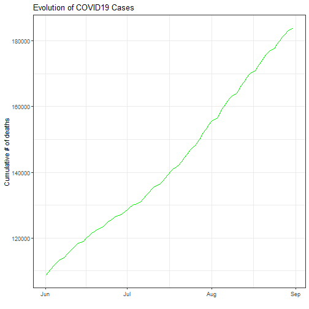

COVID19 App Pitch
========================================================
author: Konstantinos Patelis
font-import: http://fonts.googleapis.com/css?family=Risque
font-family: 'Risque'
date: 22/01/2021
autosize: true

The Idea
========================================================

We aim to build an application where individuals will be able to track key metrics regarding the COVID19 virus, across various countries in the world.
The users will be able to:

- Select across different metrics related to the COVID19 pandemic
- Focus on a specific country of interest
- Optionally, view a specific period of time

This would help users have a better understanding of the pandemic evolution, throughout the world.

This app is part of an assignment for the "Developing Data Products" course in Coursera, part of the Data Science Specialization.

The Data
========================================================

For the data we can make use of the excellent [COVID19](https://github.com/covid19datahub) package.
The package pulls data from the COVID-19 Data Hub, for many countries from the 1st of January 2020 until the present day.

Some of the metrics available are:
- Number of confirmed cases
- Number of deaths
- Number of hospitalizations
- + many more..

Guidotti, E., Ardia, D., (2020), "COVID-19 Data Hub", Journal of Open Source Software 5(51):2376, doi: 10.21105/joss.02376.

The App
========================================================

An example of the plot produced by the app can be seen below, focusing on USA cumulative deaths from the COVID19 pandemic between June and August. 
The extra benefit from using the app would be that the user is able to supply these options interactively.

The app can be found at: https://kpatelis.shinyapps.io/COVID19_Plot/

Q&A
========================================================

Any questions?

